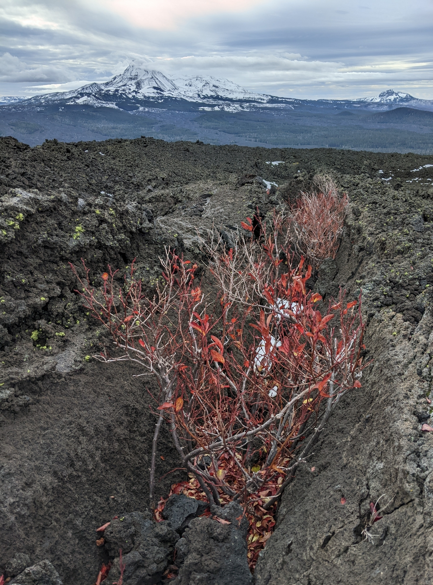
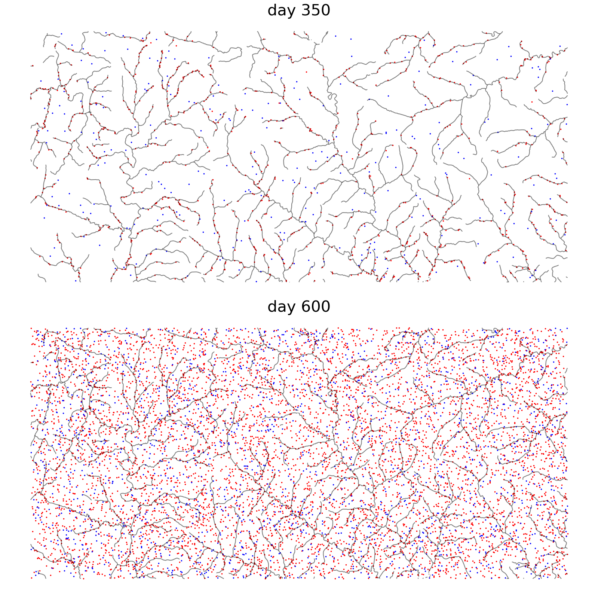
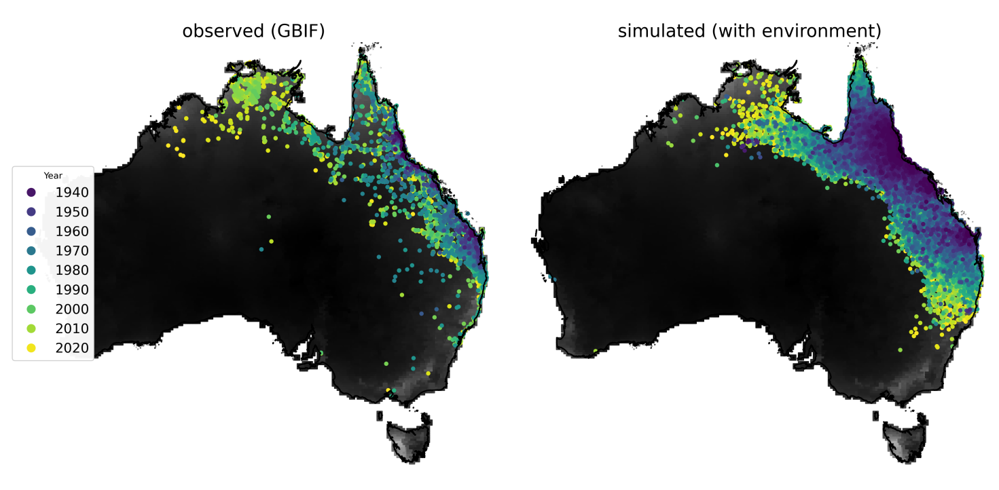
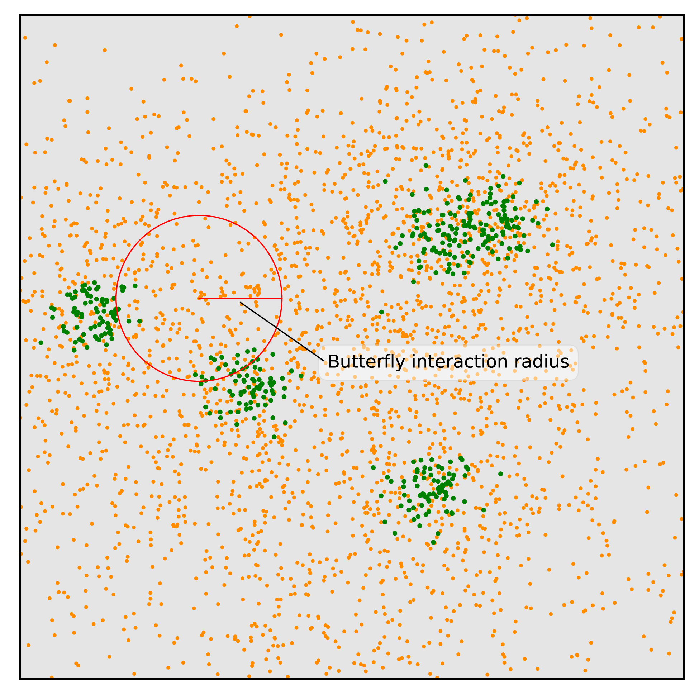

# Why simulate? In space?

## {data-background-image="figs/oregon_geological_map.png"}

## Uses for simulations

::: {.centered}
{width=60%}
:::

- exploration and intuition-building
- development of theory
- bespoke confirmatory simulations
- optimization of one or two parameters
    <!-- *(if between-simulation noise is small)* -->
- Approximate Bayesian Computation (ABC)
- deep learning

## Enter SLiM

::: {.columns}
::::::: {.column width=50%}

by Ben Haller and Philipp Messer

an individual-based, scriptable forwards simulator

:::: {.caption}
{width=45%}
{width=45%}
::::

:::
::::::: {.column width=50%}

[messerlab.org/SLiM](https://messerlab.org/SLiM/)

:::
:::::::

-----------------

::: {.centered}

:::

--------------------------------

::: {.columns}
::::::: {.column width=50%}

Some spatial processes

- range expansion

- density dependence

- coexistence

- speciation

- local adaptation

:::
::::::: {.column width=50%}

:::
:::::::

# How to simulate, in space.

## Overview of ingredients:

::: {.columns}
::::::: {.column width=50%}

- adult movement
- mating
- birth and dispersal
- other interactions

:::
::::::: {.column width=50%}

:::
:::::::

## Interactions

::: {.columns}
::::::: {.column width="50%"}

Based on *interaction kernels*, e.g.
$$
    \rho(r) = \frac{1}{2 \pi \sigma^2} e^{- r^2 / 2 \sigma^2}
$$

applied to the distance to the other individual.

:::
::::::: {.column width="50%"}

{width=100%}

:::
:::::::

## Interactions

::: {.columns}
::::::: {.column width="50%"}

Based on *interaction kernels*, e.g.
$$
    \rho(r) = \frac{1}{2 \pi \sigma^2} e^{- r^2 / 2 \sigma^2}
$$

applied to the distance to the other individual.

:::
::::::: {.column width="50%"}

{width=100%}

:::
:::::::

##  

::: {.columns}
::::::: {.column width="50%"}

1. **Mate choice:** 

    individual $i$ chooses partner $j$ at distance $d_{ij}$ 
    with probability proportional to $\rho(d_{ij})$.

:::
::::::: {.column width="50%"}

{width=100%}

:::
:::::::

##  

::: {.columns}
::::::: {.column width="50%"}

2. **Dispersal:** 

    offspring live near their parents.

:::
::::::: {.column width="50%"}

{width=100%}

:::
:::::::

##  

::: {.columns}
::::::: {.column width="50%"}

3. **Population regulation:**

    with local density
    $$ D_i = \sum_j \rho(d_{ij}) , $$

    - *survival*, 
    - *fecundity*, and/or 
    - *establishment* 

    decrease with $D$.

:::
::::::: {.column width="50%"}

{width=100%}

:::
:::::::

# Examples:

## Warming pikas

------------------

::: {.columns}
::::::: {.column width="50%"}

Pikas: (Chris Smith)

- 266 km$^2$ part of RMNP
- Beverton-Holt density dependence on mortality
- temperature:
    * a linear function of elevation
    * fluctuates with season
    * plus noise
    * warming at 0.016°C/yr
- pikas die if outside of -5°C to 28°C 

:::
::::::: {.column width="50%"}

:::
:::::::

-----------------------------

## Mosquitos in Burkina Faso

::: {.columns}
::::::: {.column width="50%"}

*Anopheles gambiae*: Jiseon Min

- larvae live in water, have density-dependent mortality
- adults mate, oviposit in nearby water
- water availability fluctuates seasonally based on a map

:::
::::::: {.column width="50%"}

:::
:::::::

-----------------------------

## Invading toads

::: {.columns}
::::::: {.column width="50%"}

*Bufo marinus*: Silas Tittes

- survivorship a logistic function of annual precipitation
- began with 10K individuals in 1935 
- $t$-distributed yearly movement
- reached 70 million simulated toads in simulated 2019

:::
::::::: {.column width="50%"}

:::
:::::::

## Milkweeds & Monarchs

::: {.columns}
::::::: {.column width="50%"}

*Danaus plexippus* and *Asclepias spp*: Sam Champer

- milkweed appear in random clusters each year
- butterflies fly around, mate and oviposit on milkweed nearby
- larvae partition their plant's resources, then
- pupal survival depends on resources accumulated

:::
::::::: {.column width="50%"}

:::
:::::::

# Wrap-up

## Credit

::: {.columns}
:::::: {.column width=40%}

- Alison Etheridge

:::
:::::: {.column width=60%}

*Simulation methods:*

- Ben Haller ([messerlab.org/SLiM](https://messerlab.org/SLiM))
- Jerome Kelleher ([tskit.dev/msprime](https://tskit.dev/msprime))
- the tskit consortium ([tskit.dev](https://tskit.dev/))

{width=50%}
{width=45%}

:::
::::::

## {data-background-image="figs/guillemots_thanks.png" data-background-position=center data-background-size=50%}
